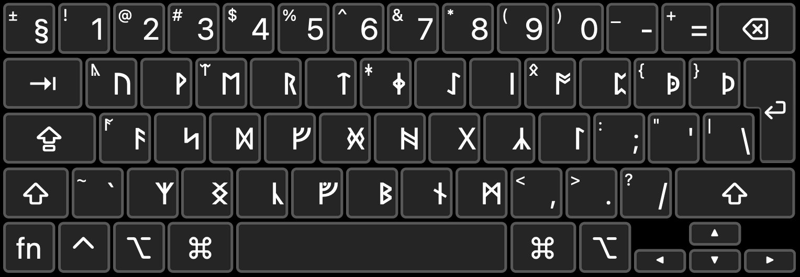

# English Runes Keyboard Layout
This is an English Runes keyboard layout for Windows and macOS, originally designed by Jeff Anderson. 

## Installation

### Windows
1. Download the contents of the `win` folder.
2. Double click `setup` to run the installation engine.

### macOS
1. Download the contents of the `macos` folder.
2. Copy both `English Runes.keylayout` and `English Runes.icns` to your `~/Library/Keyboard Layouts` directory. 

## Layout
- Hold `Shift` to type the letters in the top-left corner.
- Turn on Caps Lock to type in Latin. (macOS only)

